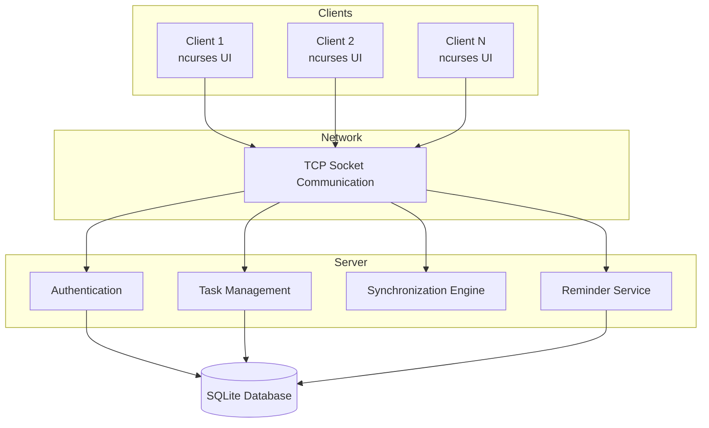
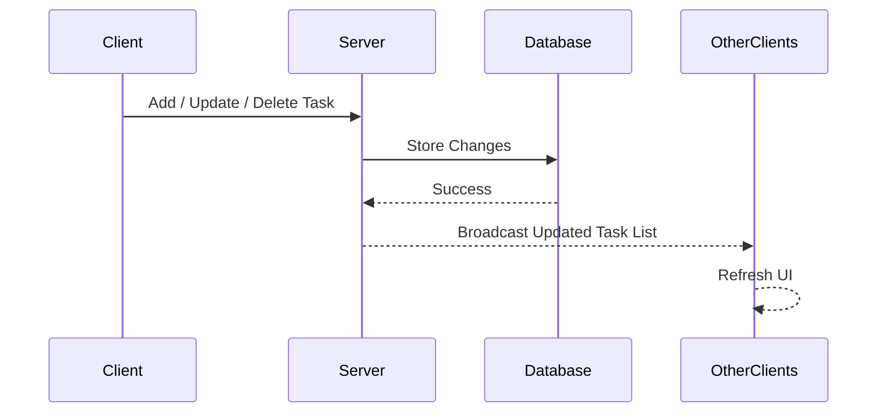
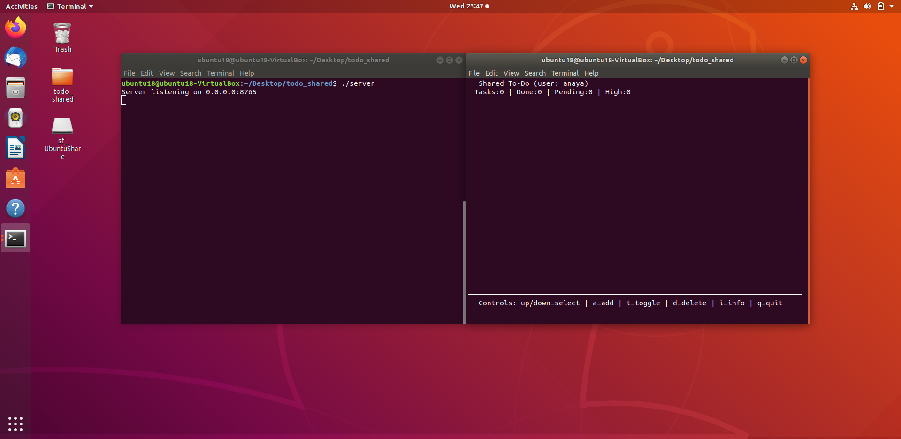
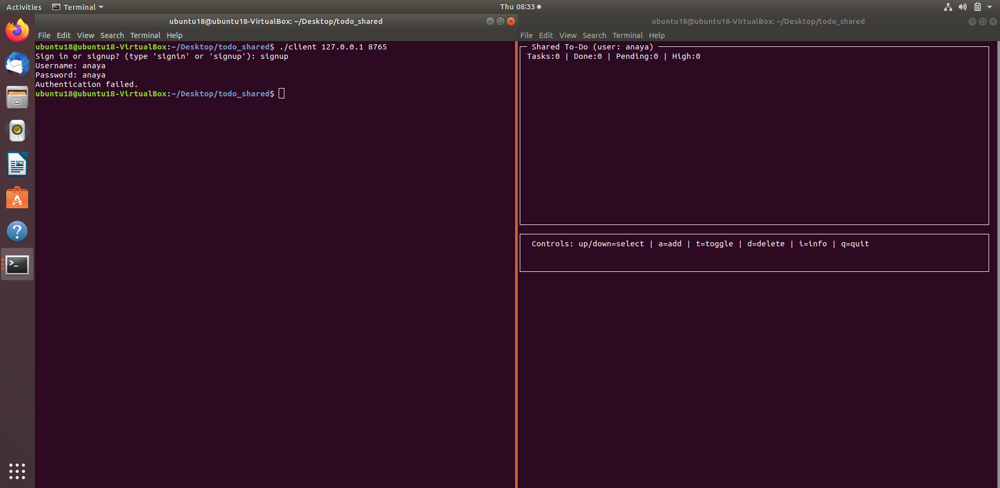
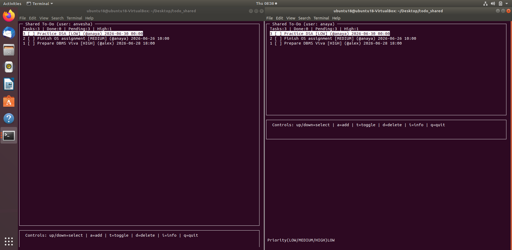
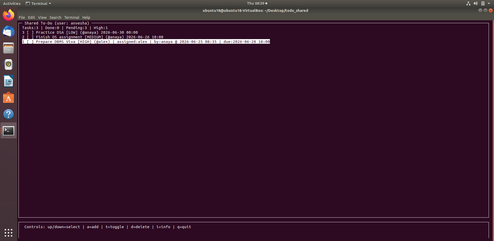
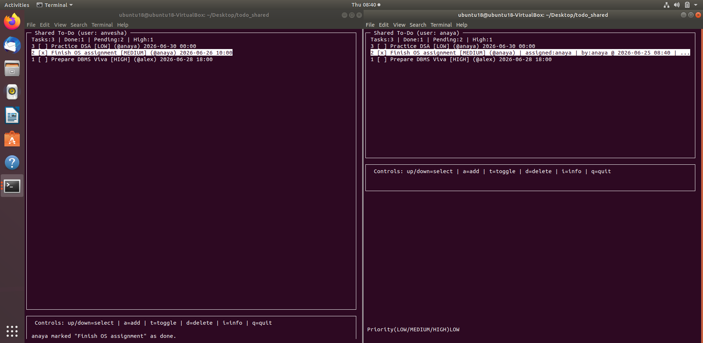
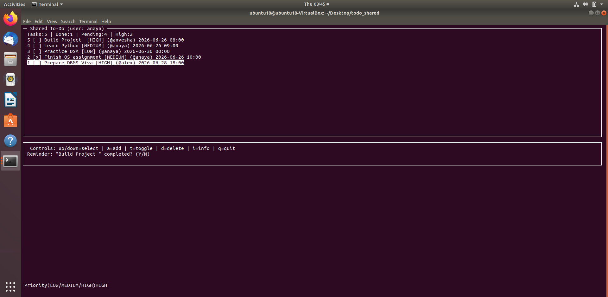

# Shared To-Do Board

A terminal-based collaborative task management system built in **C** that enables multiple users to manage shared tasks in real time over a network. The project follows a client-server architecture using **TCP sockets**, stores data persistently with **SQLite**, and provides an interactive terminal interface using **ncurses**.

---

## Features

* Multi-user collaborative task board
* User authentication (Sign Up / Sign In)
* Real-time synchronization across connected clients
* Persistent task storage using SQLite
* Task assignment to specific users
* Priority levels (High / Medium / Low)
* Due date support with reminder notifications
* Activity tracking with **Updated By** and **Updated At**
* Live task statistics (Total, Completed, Pending, High Priority)
* Toast notifications for task completion
* Interactive terminal interface using **ncurses**

---

## Tech Stack

| Component   | Technology               |
| ----------- | ------------------------ |
| Language    | C                        |
| Networking  | TCP Sockets              |
| Database    | SQLite3                  |
| Terminal UI | ncurses                  |
| Concurrency | POSIX Threads (pthreads) |
| Build Tool  | Make                     |
| Platform    | Linux (Ubuntu)           |

---

## System Architecture



---

## Workflow



---

## Screenshots

### 1. Server and Client Execution

Demonstrates the server running alongside a connected client.



---

### 2. User Authentication

Duplicate account registration is prevented through SQLite-backed authentication.



---

### 3. Multiple Connected Users

Two authenticated users connected simultaneously to the same server.Tasks created or modified by one client are immediately synchronized across all connected clients.



---

### 4. Task Info (Meta data)

View detailed task information including assignee, priority, due date, last updated timestamp, and the user who last modified the task.



---

### 5. Toast Notifications

Toast notifications inform connected users whenever a task is marked as completed.



---

### 6. Reminder Notifications and Task Statistics

Displays due task reminders together with live statistics including:

* Total Tasks
* Completed Tasks
* Pending Tasks
* High Priority Tasks



---

## Building the Project

Clone the repository:

```bash
git clone https://github.com/<your-username>/Shared-ToDo-Board.git
cd Shared-ToDo-Board
```

Compile the project:

```bash
make
```

---

## Running the Project

Start the server:

```bash
./server
```

Run one or more clients:

```bash
./client <SERVER_IP> 8765
```

Example (same machine):

```bash
./client 127.0.0.1 8765
```

Example (different machines on the same network):

```bash
./client 192.168.x.x 8765
```

---

## Client Controls

| Key   | Action                   |
| ----- | ------------------------ |
| ↑ / ↓ | Navigate through tasks   |
| a     | Add a task               |
| t     | Toggle task completion   |
| d     | Delete selected task     |
| i     | Show / Hide task details |
| q     | Quit client              |

---

## Project Structure

```text
.
├── client.c          # Client implementation and terminal UI
├── server.c          # Server implementation
├── common.h          # Shared protocol definitions
├── Makefile
├── tasks.db          # SQLite task database
├── users.db          # SQLite user database
└── README.md
```

---

## Concepts Demonstrated

* Client-Server Architecture
* TCP Socket Programming
* Multithreading with POSIX Threads
* SQLite Database Integration
* Binary Communication Protocol Design
* Real-Time State Synchronization
* Terminal User Interface using ncurses
* Persistent Data Management

---

## Future Enhancements

* Password hashing for improved security
* TLS encrypted communication
* Search and filtering of tasks
* Task sorting by due date or priority
* Role-based access control
* File attachments for tasks

---

## Author

Developed as a **Computer Systems Programming** course project to explore networking, concurrency, persistent storage, and terminal-based application development in C.
